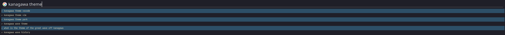

# kanagawa-surfingkeys
<<<<<<< HEAD
=======
The [kanagawa](https://github.com/rebelot/kanagawa.nvim) colorscheme for [Surfingkeys](https://github.com/brookhong/Surfingkeys)

>>>>>>> eed432330712c09a4700e0d91bc39e5f91056fc7
